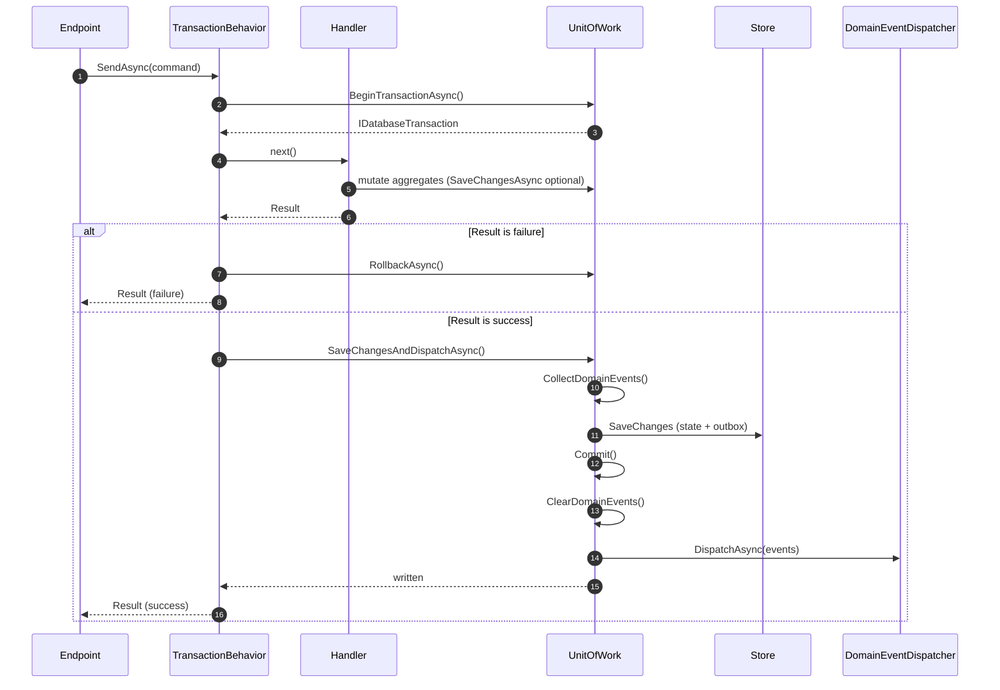

# Persistence and Dispatch Seam

Implementation reference for the transaction and domain-event dispatch seam defined by
[ADR-009](../decisions/ADR-009-Domain-Event-Dispatching-Strategy.md).

The seam is the single commit and dispatch point for commands. It is provided by the platform
(`BSX.BuildingBlocks`) and consumed by Infrastructure; modules never implement it themselves.

---

## Contracts

| Contract | Responsibility |
| --- | --- |
| `IUnitOfWork.SaveChangesAndDispatchAsync` | Persist state and events, commit, clear, dispatch. |
| `IUnitOfWork.SaveChangesAsync` | Persist pending tracked changes (enlists in the current transaction). |
| `IUnitOfWork.BeginTransactionAsync` | Open the command transaction. |
| `IDatabaseTransaction` | `CommitAsync` / `RollbackAsync` / `DisposeAsync`. |
| `UnitOfWorkBase` | Abstract base implementing the ordered post-commit flow. |
| `IDomainEventDispatcher` | In-process post-commit domain event dispatch. |
| `TransactionBehavior<TRequest, TResponse>` | Pipeline behavior that wraps commands and invokes the seam. |

---

## Ordering Guarantees

`UnitOfWorkBase.SaveChangesAndDispatchAsync` performs, in order:

1. **Collect** pending domain events from the tracked aggregates.
2. **Persist** state and outbox rows atomically (Infrastructure `SaveChangesAsync`).
3. **Commit** the transaction opened for the command.
4. **Clear** the aggregates' in-memory events.
5. **Dispatch** the collected events in-process.

Dispatch therefore always happens **after** commit, and events that are persisted but not yet
dispatched survive a crash for recovery (ADR-009).

Infrastructure implements the store-specific hooks: `SaveChangesAsync`, `BeginTransactionAsync`,
`CollectDomainEvents`, `ClearDomainEvents`, and `CommitAsync`.

---

## Command Flow

Queries do not enter `TransactionBehavior`; they never open a transaction and never dispatch.

---

## Failure Semantics

- A failed `Result` from the handler rolls back the transaction and skips dispatch.
- An unhandled exception propagates; the transaction is disposed (rolled back by Infrastructure).
- A dispatch failure happens **after** commit; the business state stands and the failure is
  isolated and observable (ADR-009 §5). It is not rolled back.

---

## Registration

`AddBuildingBlocks` registers the canonical behaviors in order (Logging, Validation, Transaction).
Infrastructure must register an `IUnitOfWork` implementation; commands resolve it through
`TransactionBehavior`. See
[building-blocks.md](building-blocks.md) and
[implementation-guidelines.md](implementation-guidelines.md).
