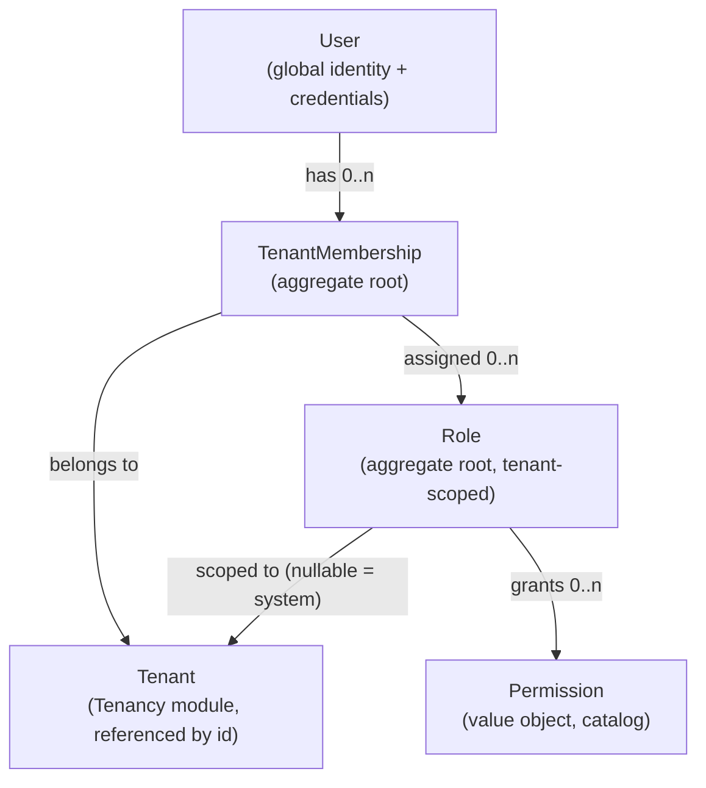

# ADR-013 - Multi-Tenant Identity Strategy

## Status

Accepted

**Amends:** the single-tenant assumption in `docs/modules/identity/`. Supersedes the previous
single-tenant `User`/`Role` model.

---

## Context

The product vision requires **multi-company support**, **SaaS readiness** and long-term
scalability ([product-vision.md](../../.opencode/context/product-vision.md)). The Identity design
was single-tenant, which the Principal Architect Review flagged as a High blocking issue: a
late change would be a rewrite of the aggregate model, the token model and the contracts.

This ADR decides the identity tenancy model, the user↔tenant relationship, role and permission
scoping, tenant switching, and email uniqueness.

Requirements the final design must satisfy:

- One user can belong to **multiple tenants**.
- A user can hold **different roles per tenant**.
- The model supports future **SaaS evolution** and **self-service onboarding**.
- Enterprise isolation remains achievable.

---

## Decision

Adopt a **global identity with multi-tenant membership**.

### 1. Single-tenant vs multi-tenant model

The identity model is **multi-tenant**. Tenancy is expressed through membership and token scope,
not through duplicated identities.

### 2. Global users vs tenant-specific users

Users are **global**. A `User` is a single, platform-level identity (one set of credentials, one
profile) that exists once across all tenants. Authorization is scoped by membership.

### 3. User-to-tenant relationship

A dedicated **`TenantMembership` aggregate** links a `User` to a `Tenant`. Membership is not
embedded in `User`, so aggregates stay small and membership evolves independently.

| Field | Meaning |
| --- | --- |
| `MembershipId` | Strongly typed identity. |
| `TenantId` | The tenant (owned by the future Tenancy module; referenced by id only). |
| `UserId` | The global user. |
| `Status` | `Invited`, `Active`, `Suspended`. |
| `Roles` | Tenant-scoped role assignments (`RoleId` set). |
| `InvitedByUserId` | Provenance for onboarding. |
| `JoinedOnUtc` | When membership became active. |

### 4. Tenant membership model

- A user has zero or more memberships (one per tenant).
- A user with **no membership** can authenticate but has no tenant permissions (for example, to
  accept an invitation or manage their own profile).
- Invitations create `Invited` memberships that become `Active` on acceptance.

### 5. Role assignment strategy

Roles are **tenant-scoped**. `Role` gains a nullable `TenantId`:

- `TenantId = <tenant>` → a role owned by that tenant, assignable only to that tenant's
  memberships.
- `TenantId = null` → a **platform/system role** (for example `Administrator`), assignable across
  tenants.

Role assignment lives on `TenantMembership.Roles`; a user's roles are therefore always
resolved **within a tenant**.

Uniqueness: role name is unique per `(TenantId, Name)`; system role names are unique among
`TenantId = null`.

### 6. Permission assignment strategy

- Permissions are platform-defined value objects (`module.resource.action`), unchanged
  ([permissions-model](../modules/identity/permissions-model.md)).
- Roles grant permissions; roles are tenant-scoped.
- **Effective permissions for a tenant** = permissions of the membership's roles ∪ permissions of
  the user's platform roles.

### 7. Tenant switching strategy

- The user authenticates once, globally.
- The access token is **tenant-bound**: it carries `tenant` (active tenant), `membership`
  (membership id) and the tenant's effective `permission` claims.
- Switching tenant **re-issues an access token** for the target tenant without re-authenticating,
  provided an `Active` membership exists (`POST /identity/tenants/{tenantId}/switch`, or a refresh
  with a tenant selection).
- If the user belongs to exactly one tenant, that tenant is selected automatically.

### 8. Email uniqueness

Choose **Option A — global email uniqueness**.

A user is a global identity; login resolves a single user by email. Global uniqueness makes login
unambiguous, enables SSO and external identity linking, and prevents identity fragmentation.

---

## Email Uniqueness - Options

### Option A - Global email uniqueness (chosen)

Advantages:

- Unambiguous login; one identity per person.
- Simple and correct SSO/external-provider linking.
- No duplicate identities to reconcile.

Disadvantages:

- The same email cannot exist as two independent users.
- A person working for two companies uses one identity (desired for BSX).

### Option B - Tenant-scoped email uniqueness (rejected)

Advantages:

- Strong isolation; the "same email" can exist in different tenants.
- Login can be scoped by subdomain/slug or tenant hint.

Disadvantages:

- Login becomes ambiguous without a tenant hint.
- The same person becomes multiple identities; SSO and profile management fragment.
- Conflicts with "one user belonging to multiple tenants".

Option B is only appropriate for a strictly isolated, per-tenant database deployment model. That
model may still be offered later (see Future Considerations) without changing this identity rule
if tenant routing is added; it is not chosen now.

---

## Domain Model

Aggregates: `User` (global), `TenantMembership`, `Role` (tenant-scoped). Credentials are decided
in [ADR-014](ADR-014-Credential-Model-Strategy.md). See
[identity-hardening.md](../diagrams/identity-hardening.md) for the full tenancy diagrams.

### Invariants

- `User.Email` is globally unique.
- `TenantMembership` is unique per `(TenantId, UserId)`.
- A `Role` is assignable only to memberships of the same tenant (or to any tenant if system).
- A suspended membership grants no tenant permissions.
- A role's permissions must exist in the catalog.

---

## Alternatives Considered

- **Option B tenant-scoped email** — rejected (see above).
- **Tenant-specific users (identity duplicated per tenant)** — rejected: identity fragmentation.
- **Membership embedded in `User`** — rejected: large aggregate, poor concurrency, harder
  independent lifecycle.
- **Per-tenant identity databases** — deferred; an isolation decision for a later ADR. The
  logical model here remains valid.

---

## Consequences

### Positive

- One user, many tenants; roles differ per tenant.
- SSO and external identity linking remain coherent.
- Tenant switching is a token operation, not a re-authentication.
- Email uniqueness is unambiguous.
- Compatible with the reserved `TenantId` shadow property (ADR-010) and global query filters.

### Negative

- Token issuance needs tenant context; a user with many tenants must select one.
- Every tenant-scoped query and unique index must include `TenantId`.
- Removing a user from a tenant must revoke that tenant's tokens.

---

## Future Considerations

- **Self-service onboarding:** creating a tenant creates an `Owner` membership; invitations create
  `Invited` memberships.
- **Per-tenant SSO/IdP:** external providers bind to the global user, scoped by tenant policy.
- **Platform administration:** platform roles (`TenantId = null`) govern cross-tenant operations.
- **Data isolation:** shared-schema, schema-per-tenant or database-per-tenant can be layered on
  the logical model without changing the identity rules.
- **Identity linking/merging:** global uniqueness minimizes the need but a merge path may be
  required for external-provider collisions.
