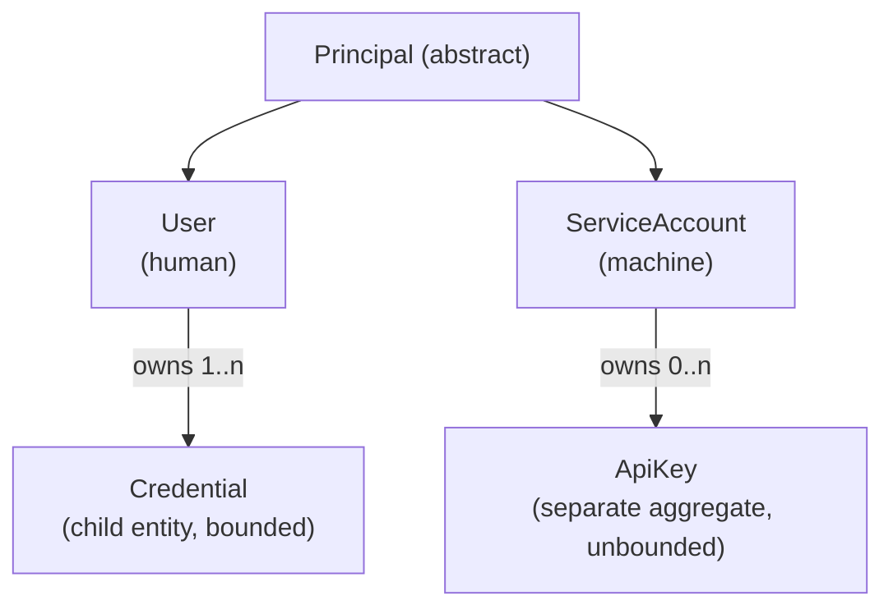

# ADR-014 - Credential Model Strategy

## Status

Accepted

**Supersedes:** the single `PasswordCredential` on `User` in `docs/modules/identity/`.

---

## Context

The Principal Architect Review flagged that a single `PasswordCredential` on `User` blocks MFA,
recovery codes, passkeys (WebAuthn), external providers (Microsoft, Google), API keys and service
accounts. The platform must be prepared for all of them without a later aggregate redesign.

Future extensibility is more important than implementation simplicity for this decision.

The question: do credentials belong **inside** the `User` aggregate, as **child entities**, or as
**separate aggregates**?

---

## Decision

Adopt a **principal-based, hybrid credential model**:

1. **Human authentication factors** are **child entities of a `Principal` aggregate**, because
   they are bounded in number and governed by per-principal invariants.
2. **Machine credentials** (`ApiKey`) are a **separate aggregate**, because they are
   high-cardinality and have an independent lifecycle.
3. Introduce a **`Principal`** abstraction so `User` (human) and `ServiceAccount` (machine) share
   identity and authorization semantics.

### 1. Principal

A **`Principal`** is anything that can authenticate and be authorized: a `User` (human) or a
`ServiceAccount` (machine). Authorization (`ICurrentUser`, `IPermissionChecker`, auditing) works
against a `PrincipalId` ([ADR-012](ADR-012-Authorization-Architecture.md)).

### 2. Credential is a child entity of the human `User`

A `Credential` is a child entity varying by **type**:

| Credential type | Purpose | Notes |
| --- | --- | --- |
| `PasswordCredential` | Password authentication | Hash + algorithm + changed-at. |
| `TotpCredential` | MFA (TOTP) | Shared secret (encrypted), verified flag. |
| `RecoveryCodeCredential` | MFA recovery | Set of single-use hashed codes. |
| `WebAuthnCredential` | Passkeys | Credential id, public key, sign counter, transports. |
| `ExternalProviderCredential` | Microsoft, Google, etc. | Provider + external subject id + linked-at. |

Rationale for child entities:

- The number of human factors per user is **bounded** (single digits to low tens).
- Invariants are **per-user**: at least one active primary credential, unique provider per user,
  lockout and recovery lifecycle.
- Keeping them in one aggregate makes those invariants enforceable in a single transaction.

### 3. ApiKey is a separate aggregate

`ApiKey` is a root because it is:

- **High-cardinality** (a service account may hold many keys).
- Independently **rotated, expired, disabled and revoked**.
- Never a human authentication factor.

| Field | Meaning |
| --- | --- |
| `ApiKeyId` | Strongly typed identity. |
| `PrincipalId` | Owning principal (usually a `ServiceAccount`). |
| `Name` | Operator label. |
| `Prefix` | Non-secret lookup prefix (safe to log/display). |
| `Hash` | Hash of the secret; plaintext shown once at creation. |
| `Scopes` | Permissions granted to the key (subset of the principal's). |
| `ExpiresOnUtc` | Optional expiry. |
| `RevokedOnUtc` | Revocation. |
| `LastUsedOnUtc` | Usage tracking. |

### 4. ServiceAccount is a separate aggregate

`ServiceAccount` represents a machine principal. It has a name, a tenant scope, an enabled flag and
role assignments (same authorization model as a user membership). It has no password, MFA or
passkeys; machine authentication uses `ApiKey` (and future client-credentials/OAuth flows).

### 5. MFA is modeled as additional credentials plus a policy

- Enabling MFA creates a `TotpCredential` (and/or `WebAuthnCredential`) and a
  `RecoveryCodeCredential`.
- A per-user `MfaPolicy` (required / enrolled) and per-tenant policy determine enforcement.
- Authentication evaluates factors in order: password/passkey → MFA challenge → token issuance.

---

## Alternatives Considered

### All credentials as child entities

Pros

- One aggregate; simple invariants.
- Single transaction.

Cons

- `ApiKey` cardinality bloats the aggregate; poor concurrency for key operations.

### All credentials as separate aggregates

Pros

- Independent lifecycle; small User.

Cons

- "At least one credential" and "unique provider per user" become cross-aggregate invariants;
  harder to enforce and reason about.

### Single `PasswordCredential` (current)

Pros

- Simplest.

Cons

- Cannot support MFA, passkeys, recovery, external providers, API keys or service accounts without
  redesign (the blocking issue).

### Hybrid child + separate aggregate (chosen)

Pros

- Human invariants stay in one aggregate; machine credentials scale independently.
- Extensible: new factor types are new child entities, not new aggregate redesigns.

Cons

- Two persistence shapes; a `Principal` abstraction must be introduced.

---

## Consequences

### Positive

- All target methods are supported by construction: password, MFA, recovery, passkeys, Microsoft,
  Google, API keys, service accounts.
- Human invariants stay local to `User`; machine volume does not.
- Authorization is uniform across users and service accounts via `PrincipalId`.

### Negative

- Introducing `Principal` touches `ICurrentUser`, auditing and contracts.
- More persistence configuration and policy surface.

---

## Future Considerations

- **Additional factors:** new child credential types do not require aggregate changes.
- **Client credentials / OAuth2 flows:** service accounts extend to standard machine flows.
- **Passkey-first / passwordless:** `User` may have zero password credentials but always at least
  one active credential.
- **Hardware keys / TOTP migration:** handled as credential lifecycle.
- **Tenant-scoped external IdP:** `ExternalProviderCredential` combined with tenant policy
  (ADR-013).
