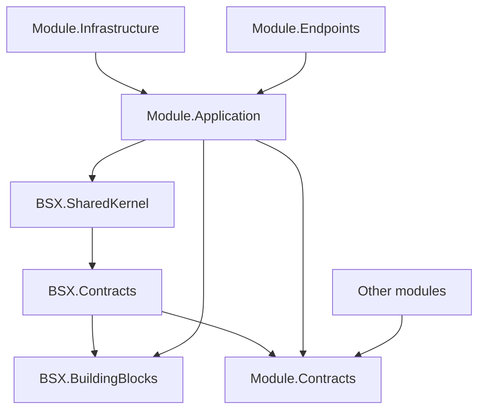

# ADR-015 - Contracts Abstraction Strategy

## Status

Accepted

**Amends:** the dependency rule that `<Module>.Contracts` may reference `BSX.SharedKernel` only
(`docs/architecture/module-boundaries.md`, `docs/architecture/implementation-guidelines.md`,
`docs/diagrams/module-structure.md`). Supersedes that rule.

---

## Context

`<Module>.Contracts` must expose integration events, but integration events implement
`IIntegrationEvent`, which lives in `BSX.BuildingBlocks.Events`. The stated rule
("`Contracts` → `BSX.SharedKernel` only") and the contract's purpose contradict each other. This
was a Critical finding: implementation could not start without resolving it.

Constraints:

- Preserve dependency direction (a module's Contracts must not drag in application/infrastructure
  internals such as FluentValidation, DI or EF Core).
- Integration events must be identifiable and publishable through the Outbox.
- Shared strongly typed identifiers (`UserId`, `RoleId`, `TenantId`) must live in exactly one
  place.
- Rule 9 forbids growing `BSX.SharedKernel`.

---

## Decision

Introduce a dedicated, dependency-light platform project, **`BSX.Contracts`**, that owns the
**cross-module contract primitives**:

- `IIntegrationEvent`
- `IntegrationEvent` base record (`EventId`, `OccurredOnUtc`, optional `TenantId`)
- Shared contract identifiers (`UserId`, `RoleId`, `TenantId`, `PrincipalId`)
- Contract metadata (event name/version conventions)

Dependency rules become:

| Project | May reference |
| --- | --- |
| `BSX.SharedKernel` | nothing |
| `BSX.Contracts` | `BSX.SharedKernel` (only if a shared primitive requires it; otherwise nothing) |
| `BSX.BuildingBlocks` | `BSX.SharedKernel`, `BSX.Contracts` |
| `<Module>.Contracts` | `BSX.Contracts` |
| `<Module>.Application` | own Domain, own Contracts, `BSX.BuildingBlocks`, `BSX.SharedKernel` |
| `<Module>.Infrastructure` | own Application, own Domain |
| `<Module>.Endpoints` | own Application |

`BSX.Contracts` contains **no** domain types, no persistence types, no DI, no validation and no
messaging implementation — only contract primitives.

---

## Alternatives Considered

### Alternative A - Allow `<Module>.Contracts` → `BSX.BuildingBlocks`

Pros

- One-line rule change; no new project.

Cons

- Contracts pull the whole BuildingBlocks surface (FluentValidation, DI, logging) into every
  consumer's compile graph.
- Blurs the boundary between pure contracts and technical building blocks.

### Alternative B - Move `IIntegrationEvent` into `BSX.SharedKernel`

Pros

- No new project.

Cons

- Rule 9 forbids growing the kernel; messaging is not a domain primitive.
- Couples the domain kernel to a messaging concern.

### Alternative C - Plain records with no marker (publisher wraps)

Pros

- Zero dependencies.

Cons

- Loses compile-time identification of integration events; discovery and registration become
  convention-only and error-prone.

### Alternative D - Introduce `BSX.Contracts` (chosen)

Pros

- Clean dependency direction; contracts stay dependency-light.
- One home for shared contract identifiers.
- `IIntegrationEvent` and the Outbox publisher share a single abstraction.

Cons

- One more platform project.

---

## Consequences

### Positive

- The Critical contradiction is resolved.
- Module Contracts stay pointer-thin and do not drag technical dependencies.
- Shared identifiers have one owner, preventing per-module duplication.
- The Outbox (`BSX.BuildingBlocks`) and contracts (module `Contracts`) share one event abstraction.

### Negative

- A new project to build and version.
- Architecture tests must add `BSX.Contracts` to the governed assemblies.

---

## Required Modifications to Previous Decisions and Docs

- `docs/architecture/module-boundaries.md`: Contracts reference `BSX.Contracts`, not only
  `BSX.SharedKernel`.
- `docs/architecture/implementation-guidelines.md`: update the module reference table.
- `docs/diagrams/module-structure.md`: add `BSX.Contracts` to the dependency graph.
- `docs/architecture/building-blocks.md`: `IIntegrationEvent` and the integration-event base move
  to `BSX.Contracts`; BuildingBlocks references it.
- `docs/modules/identity/module-boundaries.md`: update the Contracts row and shared identifiers.
- `docs/architecture/foundation.md`: add `BSX.Contracts` to the project list.

---

## Future Considerations

- Event **versioning** conventions (name + version) belong in `BSX.Contracts`.
- If an external message envelope is needed, it lives in `BSX.Contracts` so producers and
  consumers agree without referencing BuildingBlocks.
- Contract testing and schema governance can be added without changing the dependency rule.
