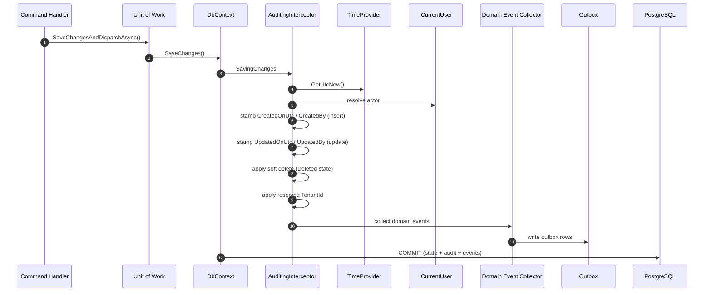
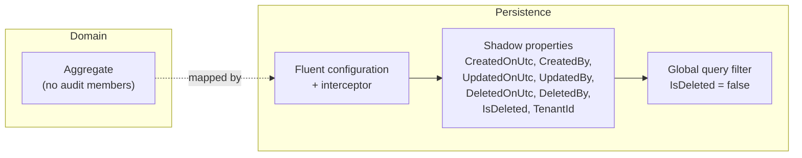
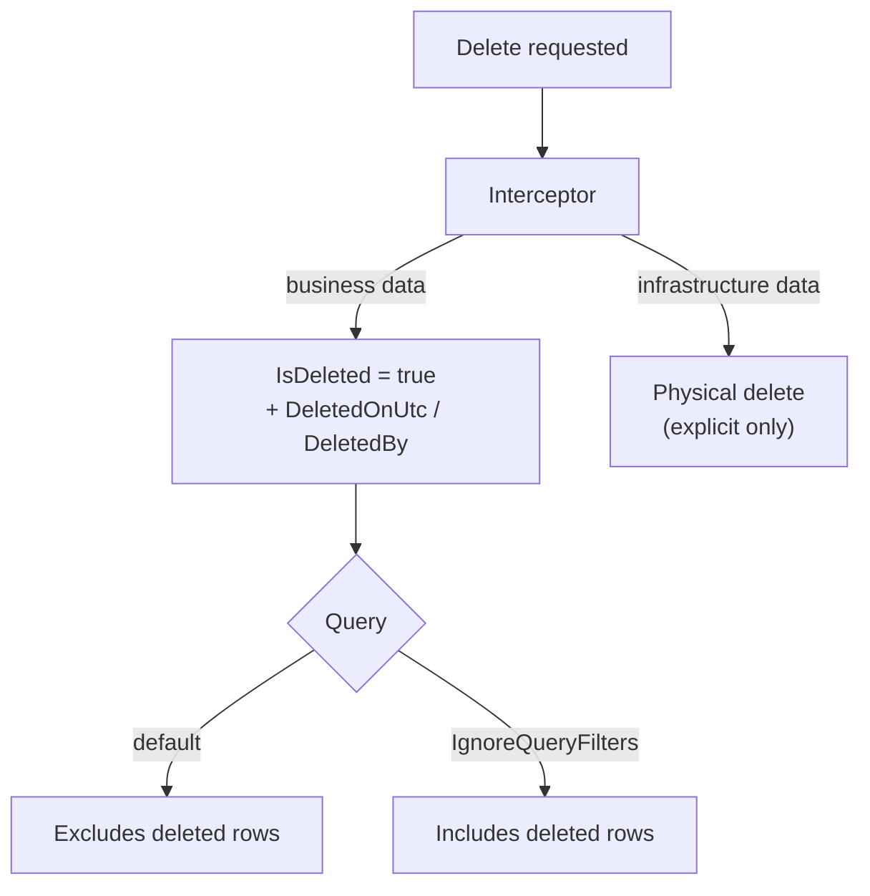

# Auditing

Automatic auditing and soft delete applied by the shared persistence pipeline (ADR-010).

## Save Pipeline

## Shadow Properties

## Soft Delete

- Uniqueness on soft-deletable data uses partial indexes (`UNIQUE ... WHERE IsDeleted = false`)
  so deleted rows do not block re-creation.
- Actor falls back to the reserved value `system` when there is no authenticated user.
