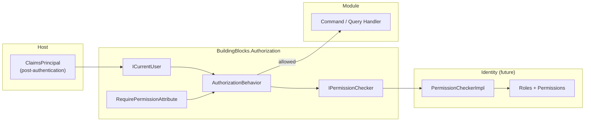
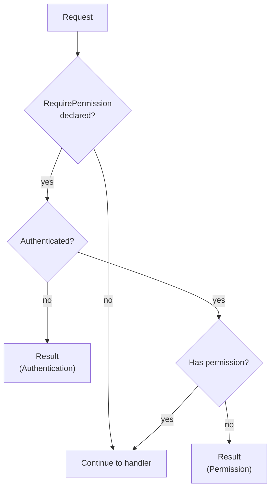
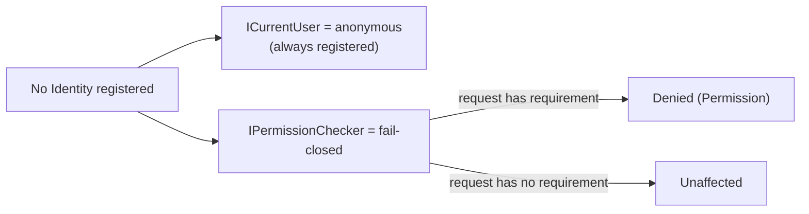

# Authorization

Permission-based authorization evaluated in the pipeline (ADR-012).

## Components

## Pipeline Decision

## Defaults Before Identity

- The gate is the permission (`resource.action`), not the role.
- Resource-level rules (ownership, tenant, entity state) are evaluated by the handler using
  `ICurrentUser`.
- Authentication (issuance/validation) is owned by Identity; the reserved permission claim type
  is `permission`.
