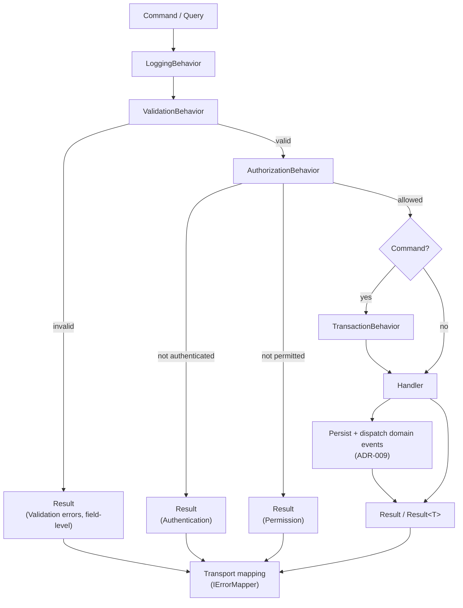

# CQRS Pipeline

Canonical order of the request pipeline. Every command and query passes through it.

| Order | Behavior | Runs for | Responsibility |
| --- | --- | --- | --- |
| 1 | `LoggingBehavior` | All | Structured start/completion logging. |
| 2 | `ValidationBehavior` | All | FluentValidation; short-circuits with structured validation errors. |
| 3 | `AuthorizationBehavior` | Requests with a requirement | Permission gate; fail-closed default. |
| 4 | `TransactionBehavior` | Commands only | Opens a transaction and commits via the unit of work. |
| 5 | Handler | All | Business logic. |

Notes:

- Queries never open a transaction.
- Behaviors are registered in this order; the first registered is the outermost.
- Further behaviors (for example, caching for queries) are inserted without reordering the four
  canonical ones.
