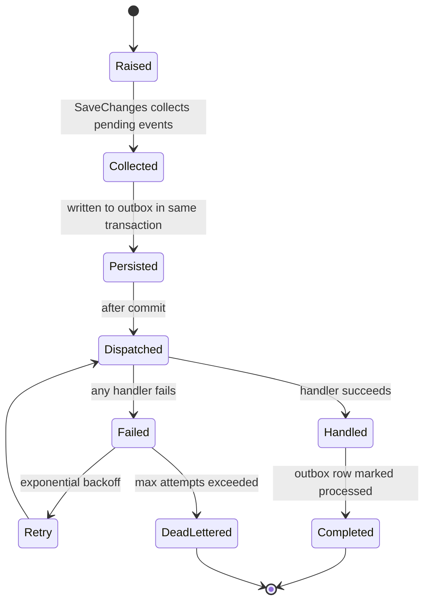
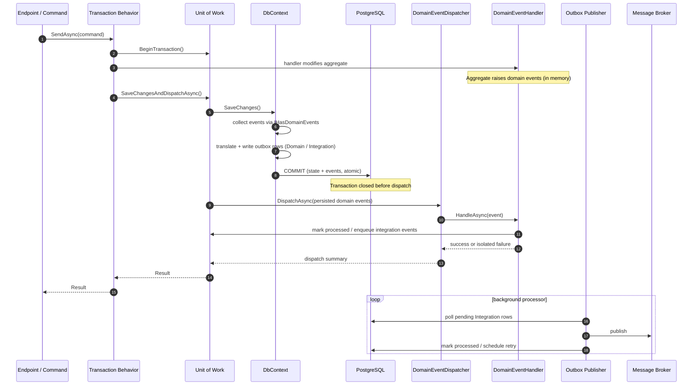
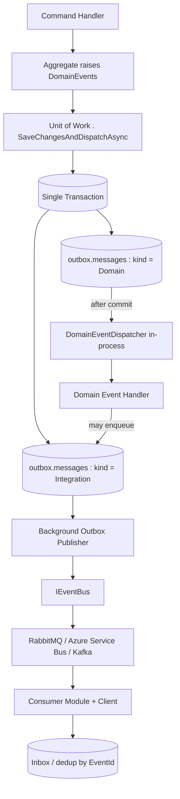
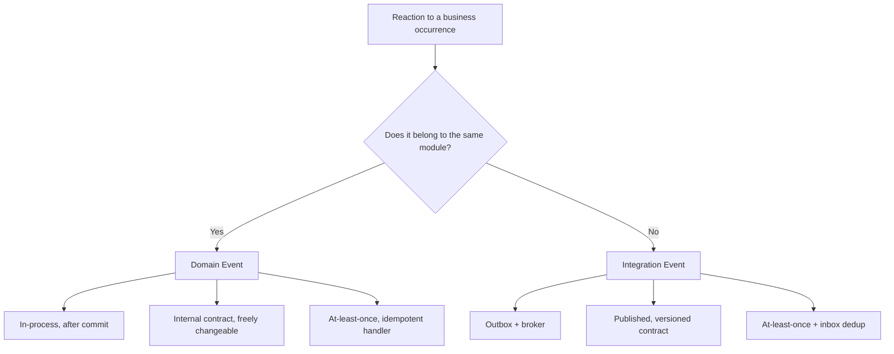
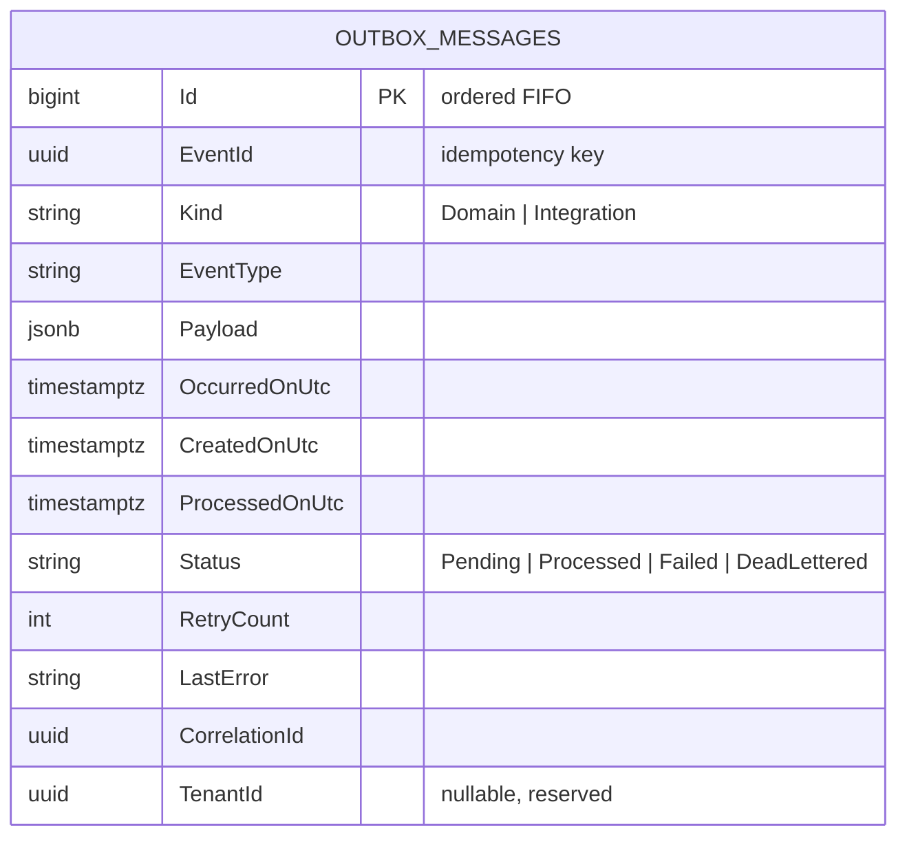
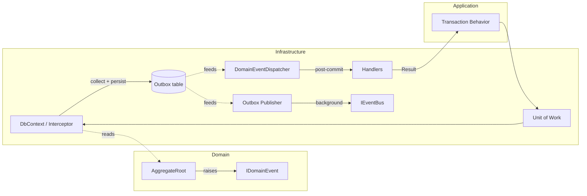

# Domain Event Dispatch

Visual reference for [ADR-009](../decisions/ADR-009-Domain-Event-Dispatching-Strategy.md).

---

## 1. Event Lifecycle

---

## 2. SaveChanges to Dispatch (request scope)

---

## 3. Two Independent Loops

---

## 4. Choosing Domain vs Integration Event

---

## 5. Outbox Table (conceptual)

---

## 6. Layer Responsibilities

