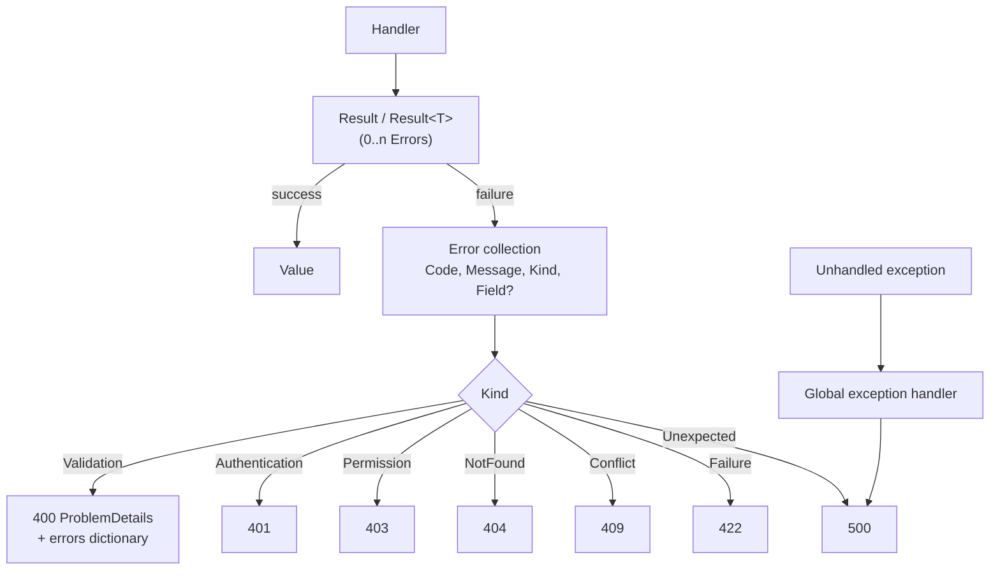
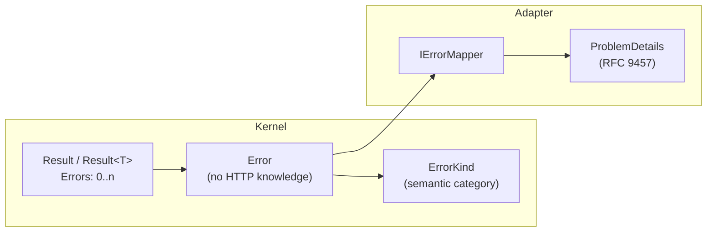

# Error Mapping

Errors are semantic in the kernel and mapped to transport only in the adapter (ADR-011).

## From Handler to Transport

## Taxonomy

## ProblemDetails Shape (validation)

| Field | Source |
| --- | --- |
| `type` | Derived from `ErrorKind`. |
| `title` | Localized summary. |
| `status` | Mapped HTTP status. |
| `detail` | Aggregated `Error.Message` values. |
| `errors` | Dictionary keyed by `Error.Field` → `(Code, Message)` list. |

- Codes are stable and namespaced (`MODULE.Subject.Problem`).
- Messages are localized; codes are not.
- `Result` is never serialized directly to the wire.
