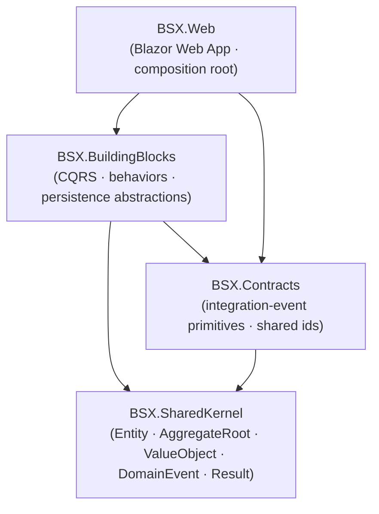

# Foundation Projects

Project dependency graph of the technical foundation.

Rules enforced by architecture tests:

- `BSX.SharedKernel` depends on nothing external.
- `BSX.Contracts` depends on `BSX.SharedKernel` only (integration-event primitives and shared ids).
- `BSX.BuildingBlocks` depends on `BSX.SharedKernel` and `BSX.Contracts`.
- `BSX.Web` depends on `BSX.BuildingBlocks` and `BSX.Contracts`.
- Modules (future) depend on the kernel, contracts and building blocks, never on each other.
