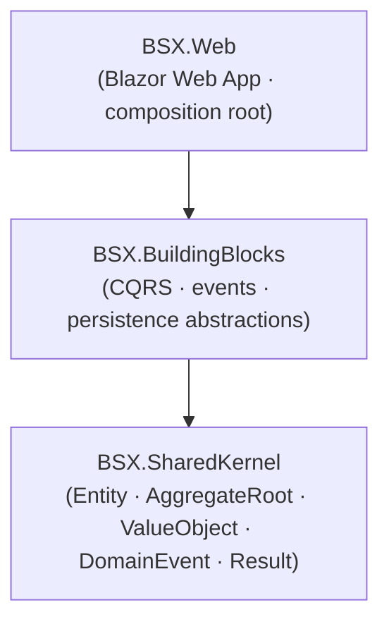

# Foundation Projects

Project dependency graph of the technical foundation.

Rules enforced by architecture tests:

- `BSX.SharedKernel` depends on nothing external.
- `BSX.BuildingBlocks` depends on `BSX.SharedKernel` only.
- `BSX.Web` depends on `BSX.BuildingBlocks` and `BSX.SharedKernel`.
- Modules (future) depend on the kernel and the building blocks, never on each other.
