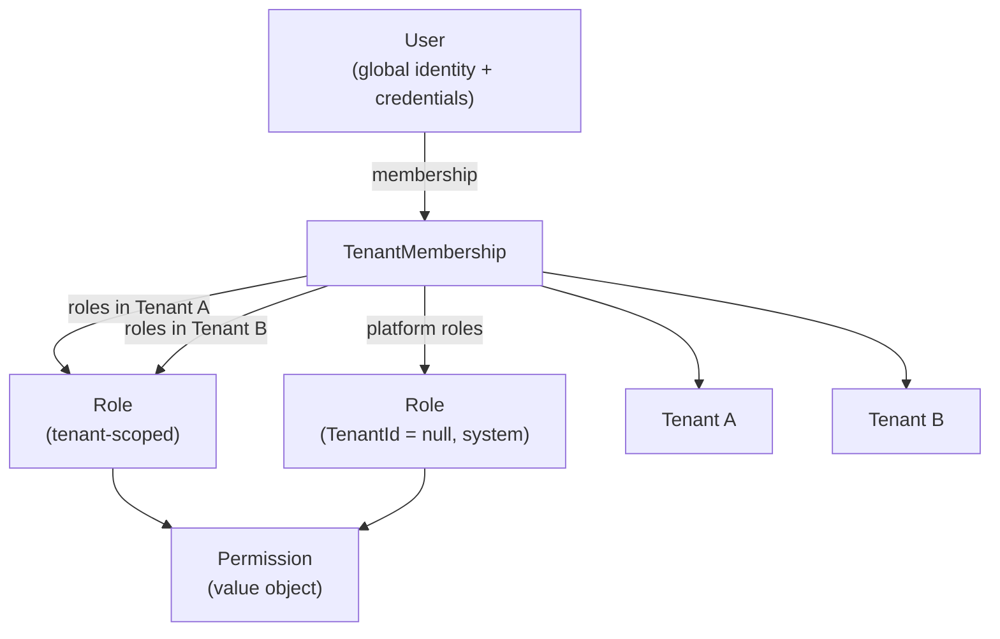
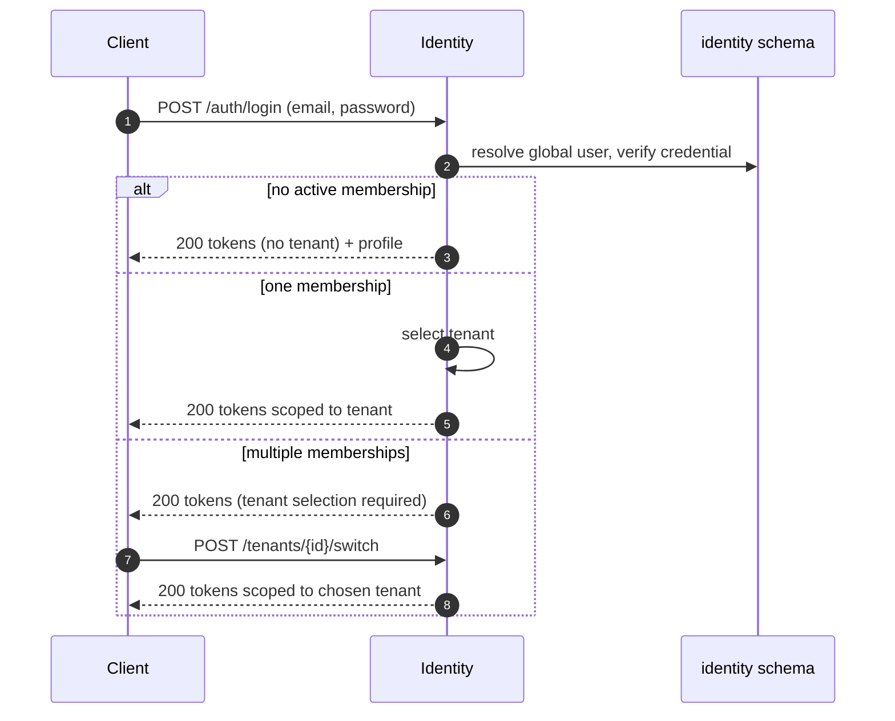
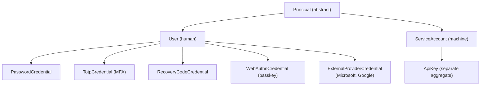
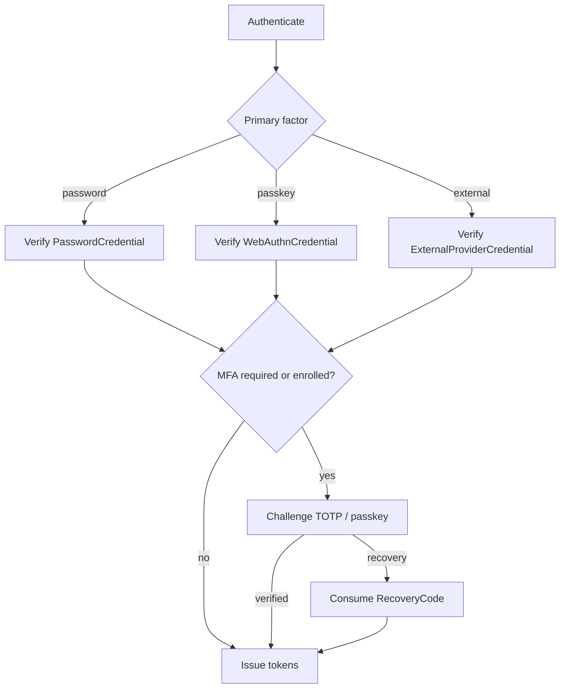
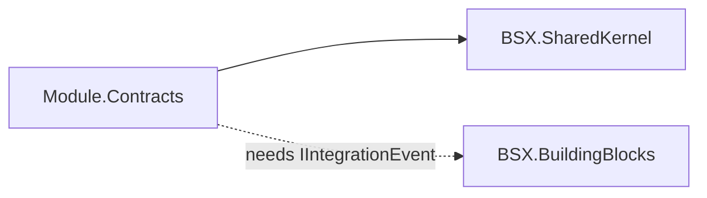
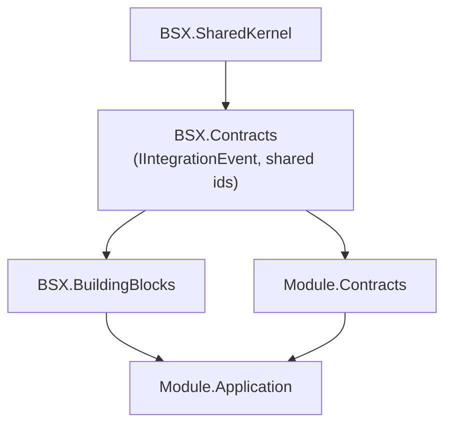
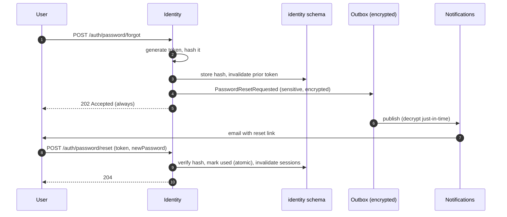
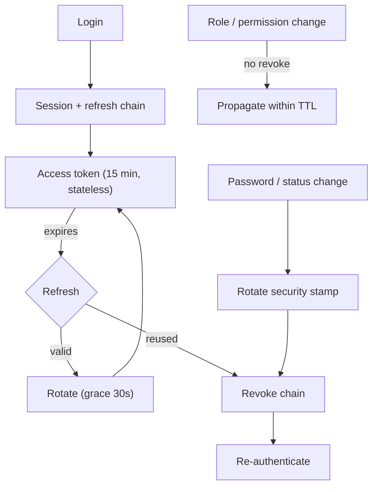
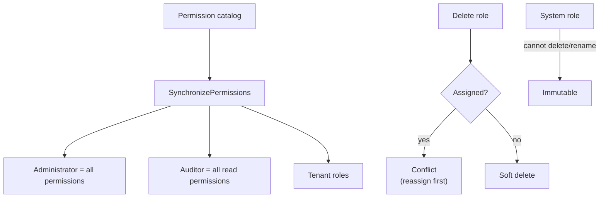
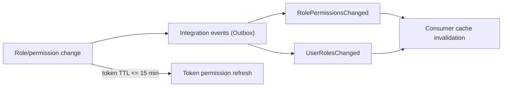

# Identity Hardening - Diagrams

Visual reference for ADR-013 through ADR-018.

---

## 1. Multi-Tenant Identity Model (ADR-013)



---

## 2. Login and Tenant Selection (ADR-013)



---

## 3. Tenant Switch (ADR-013)

```mermaid
sequenceDiagram
    autonumber
    participant C as Client
    participant I as Identity
    C->>I: POST /identity/tenants/{tenantId}/switch
    I->>I: verify active membership
    alt member
        I-->>C: new access token (tenant + permissions)
    else not a member
        I-->>C: 403 Permission
    end
    Note over C,I: No re-authentication; refresh chain unchanged
```

---

## 4. Credential Model (ADR-014)



---

## 5. Authentication Factor Flow (ADR-014)



---

## 6. Contracts Dependency (ADR-015)

### Before (contradiction)



### After



---

## 7. Password Reset Security (ADR-016)



At rest: Identity holds only the token **hash**; the Outbox holds only **ciphertext**.

---

## 8. Token Invalidation and Session Lifecycle (ADR-017)



---

## 9. Role Lifecycle and System Role Sync (ADR-018)




