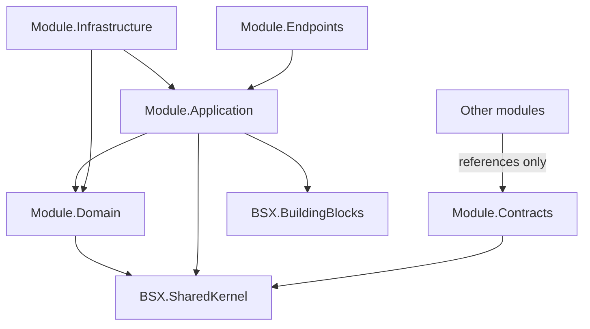
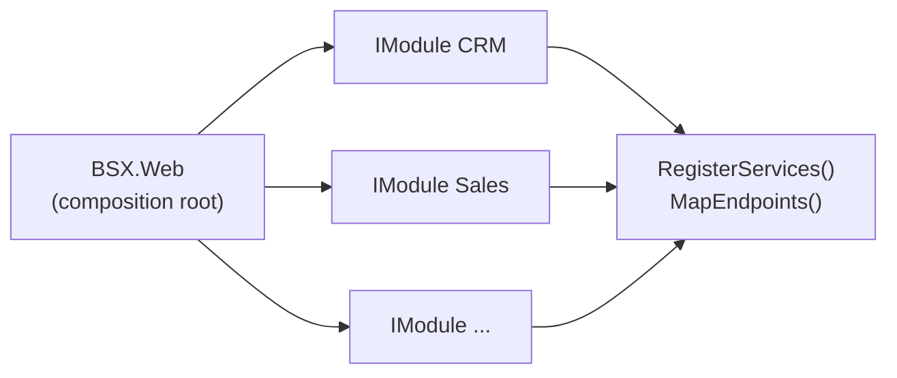

# Module Structure

Every module follows the same internal structure (Clean Architecture per module) with strict
dependency direction.

## Layout

```text
src/Modules/<Module>
├── <Module>.Domain          Aggregates, entities, value objects, domain events, rules
├── <Module>.Application     Commands, queries, handlers, validators, DTOs, ports
├── <Module>.Infrastructure  EF Core DbContext, configurations, repositories, outbox
├── <Module>.Contracts       Published contracts and integration events (only public surface)
└── <Module>.Endpoints       Minimal API endpoints / transport mapping

tests/Modules/<Module>
├── <Module>.UnitTests
└── <Module>.IntegrationTests
```

## Dependency Direction



Rules:

- `Domain` depends on the SharedKernel only. No EF Core, no BuildingBlocks, no other module.
- `Application` depends on Domain and BuildingBlocks. It defines ports; it does not implement
  infrastructure.
- `Infrastructure` depends on Application and Domain and owns EF Core.
- `Endpoints` depends on Application and maps `Result` to transport.
- Other modules reference **only** `Module.Contracts`. Direct references to another module's
  Domain/Application/Infrastructure are forbidden.
- Inter-module reactions use integration events (ADR-009), never direct calls.

## Composition



Each module exposes a single `IModule` entry point that registers its services, handlers,
validators, configurations and endpoints. The host composes modules without knowing their
internals. Solution folders `src/Modules` and `src/Platform` hold the modules until implemented.
