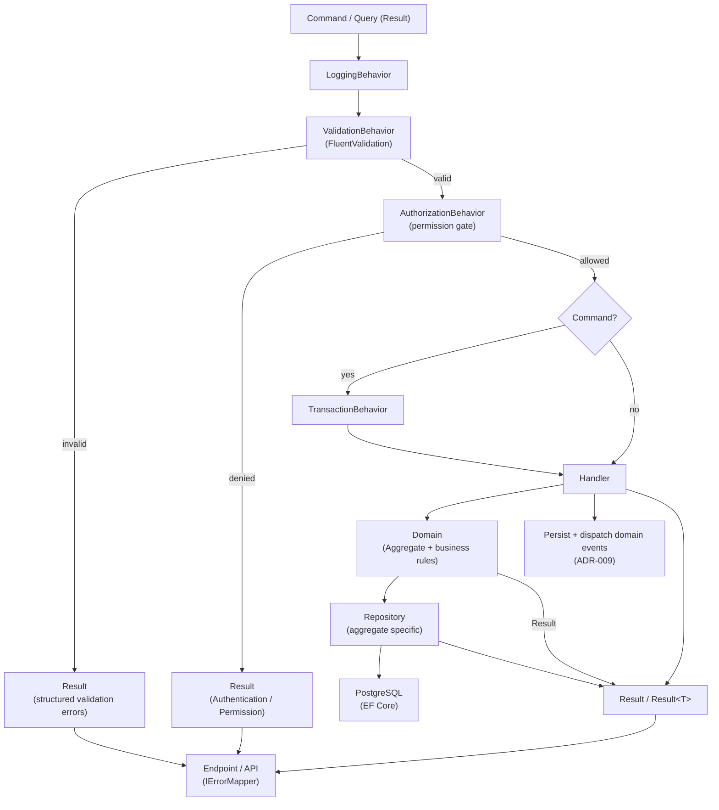

# Request Flow

How a command or query flows through the platform pipeline. See
[cqrs-pipeline.md](cqrs-pipeline.md) for the canonical behavior order.

Notes:

- Authorization runs after validation and before the handler.
- Read operations (queries) never start transactions.
- Write operations (commands) run inside a transaction and persist domain events atomically.
- Expected failures are returned as `Result` and mapped to transport by the adapter.
