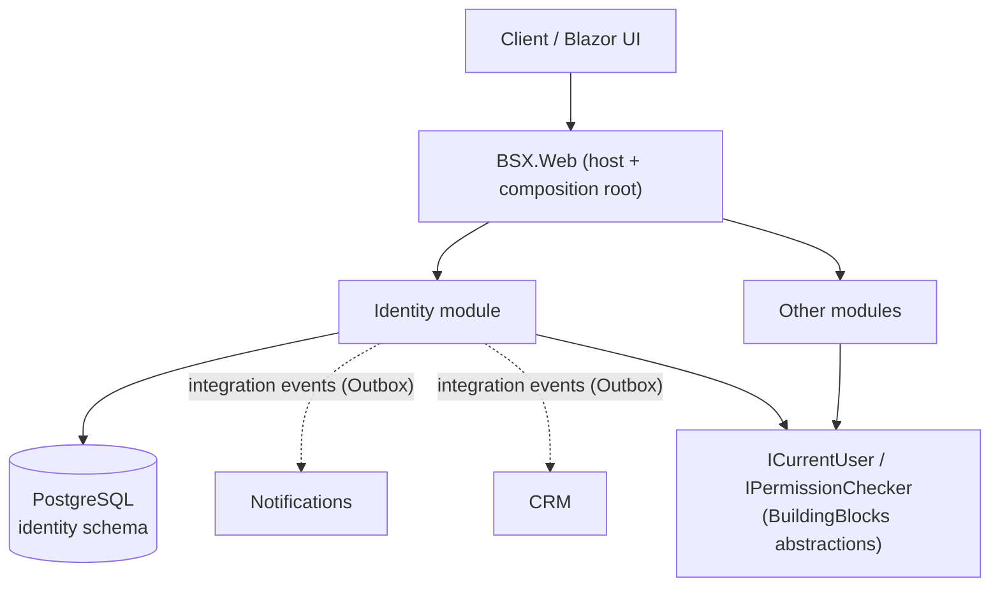
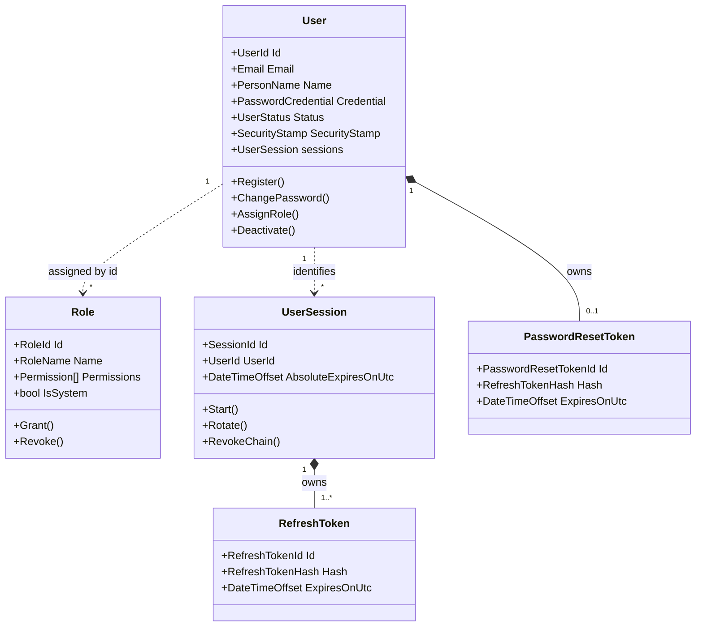
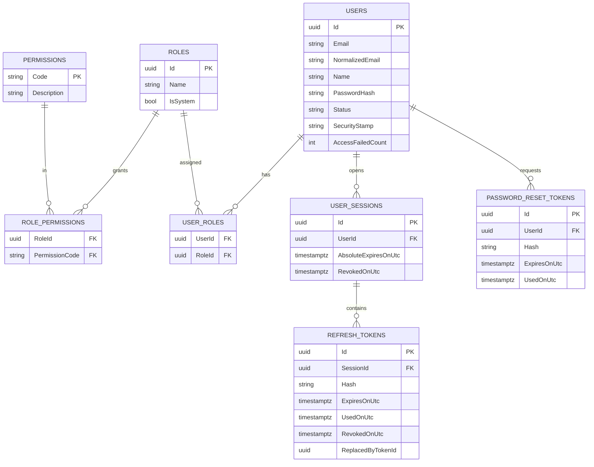
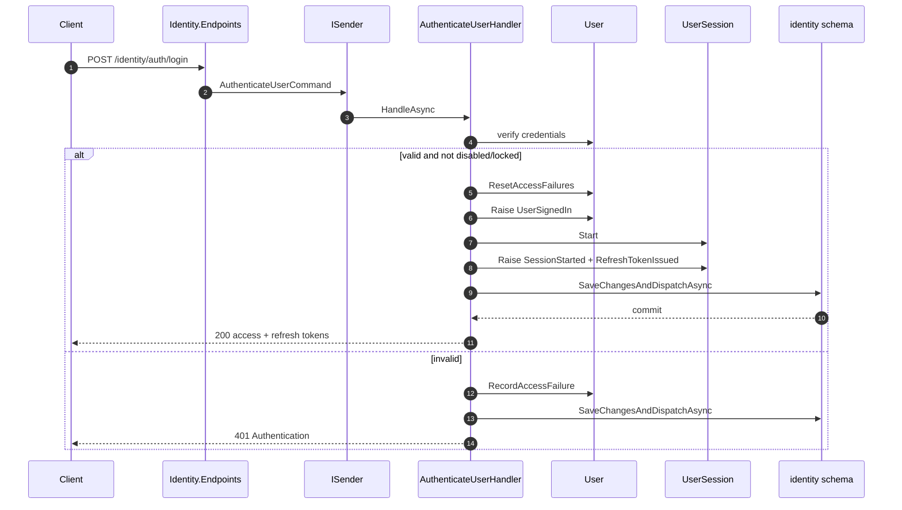
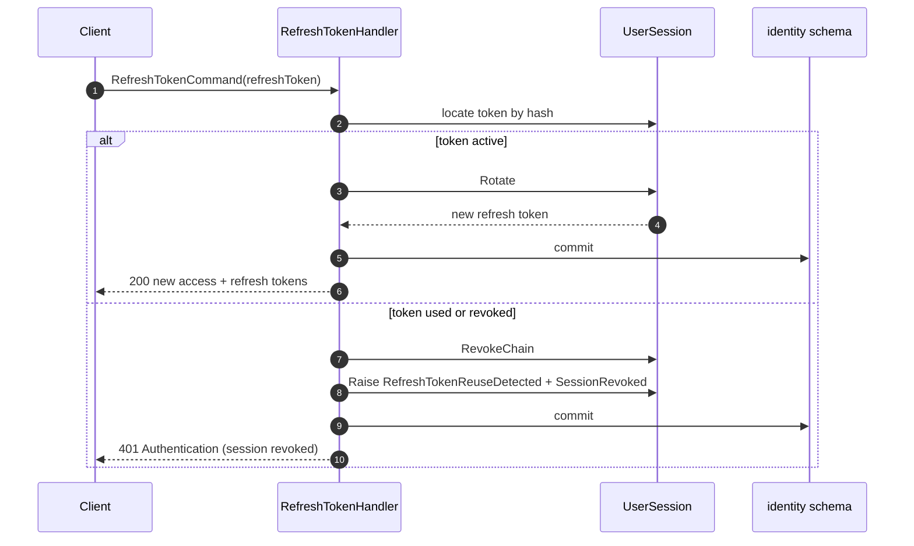
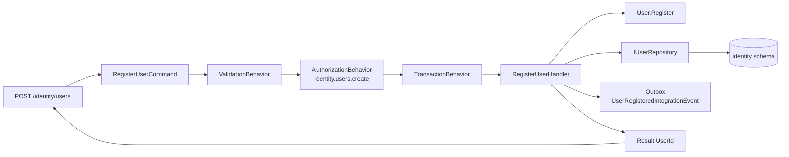

# Identity - Diagrams

Visual reference for the Identity module. Links: [domain-model.md](domain-model.md),
[authentication](jwt-strategy.md), [refresh tokens](refresh-token-strategy.md),
[module boundaries](module-boundaries.md).

---

## 1. Module Context

---

## 2. Aggregate Model

---

## 3. Entity Relationships (conceptual)

Auditing and soft-delete columns (`CreatedOnUtc`, `UpdatedOnUtc`, `IsDeleted`, `TenantId`, ...) are
shadow properties (ADR-010) and are omitted here.

---

## 4. Login Flow

---

## 5. Refresh with Rotation and Reuse Detection

---

## 6. Vertical Slice - Register User

